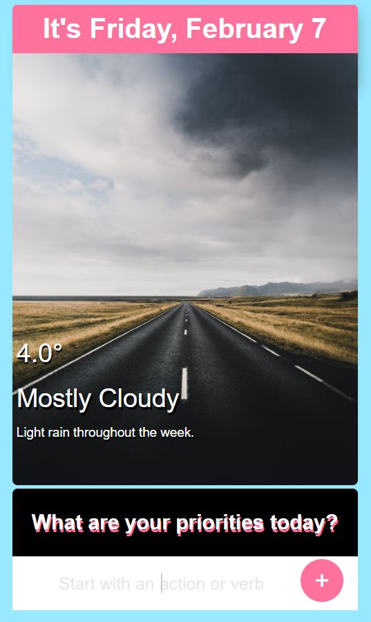

# todolist
Simple todo list using node, request, express, and ejs.
<ul>
<li>Uses ipStack & DarkSky apis to get your location, temperature, and weather details. 
<li>Displays current day & date.
<li>Displays an image based off your current weather.
</ul>

Requires an ipStack & DarkSky API KEY.

<b>Sign up here:</b>
 https://ipstack.com/documentation
 https://darksky.net/dev

# Instructions
Create a <b>config.js</b> file in the main directory.

let ipKey = "your ipStack key";
 let apiKey = "your DarkSky key";
 exports.ipKey = ipKey;
 exports.key = apiKey;

<h2>You should be good to go!</h2>

